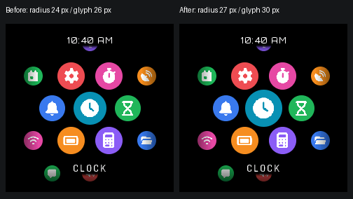

# Focused Springboard icon (T035, development 1.5.0)

The nearest/labelled app in the compact NOVA Springboard is rendered at an
additional **12.5% scale**, using the existing circle and Font Awesome renderer.
At the settled center the circular tile radius grows from **24 to 27 px** and
the glyph bounding size from **26 to 30 px**. The 54 px honeycomb spacing,
neighboring icons, palette, typography, caption backing, paper/slow-display
layout, navigation, launch rules, and touch targets are unchanged.

The boost applies only to the focused app while no launch is pending. It does
not stack with or change the existing launch pulse. Focus follows the same
nearest-app selection already used for the caption; it is not a second
selection or input state.

## Actual production pixels

Before and after are RGB565 frames rendered by the actual shared C app and
portable client with the 14-app delivered-catalog fixture. They are not mocked
browser layouts. The before run uses the immutable `Apps/` sources from System
main `585bcaa` (released implementation at `4be93c46` plus tag metadata), and the
after uses this branch. PNG conversion is lossless; the overview only places
those unscaled frames beside one another and adds labels.

- [Before, Clock focused](evidence/springboard-focus/before-focus-0.png)
- [After, Clock focused](evidence/springboard-focus/after-focus-0.png)
- [Before, Stopwatch focused](evidence/springboard-focus/before-focus-4.png)
- [After, Stopwatch focused](evidence/springboard-focus/after-focus-4.png)
- [After, smallest accepted 160×160 display](evidence/springboard-focus/after-160.png)

## Verification

`python scripts/test_springboard_nova.py` now also compiles
`test/native_apps/springboard_focus_test.c` with ASan/UBSan. It calls the
production `nova_render` and RGB565 adapter through their existing interfaces.
The test observes drawing operations without replacing the rendering code.

- 8 accepted compact geometries: 160×160, 160×320, 320×160, 240×240, 320×320,
  399×399, 240×1024, and 1024×240.
- Inventories of 1, 2, 3, 7, 14, 17, 19 and 20; every centered focus and a final
  partial page. The Watch client still admits at most 17 apps. The 19/20 tests
  extend only the test catalog getter to cover the shared app's page boundary.
- Exact focused tile/glyph dimensions; all centered focus bounds remain fully
  within the display. Real glyphs stay within the enlarged tile; the focused
  circle does not overlap any neighboring circle.
- Pixel-for-pixel equality outside the focused circle when compared with an
  unboosted render using the same production primitives; 143 between-icon pan
  samples preserve neighboring pixels.
- Strict pre-existing hit radius remains unchanged: the centered 25 px offset
  hits, the 26 px offset does not become a focused hit.
- Existing launch pulse dimensions and interrupted-launch focus recovery.
- Outer buffer sentinels and three extra stride pixels per row remain intact.
- Existing input/cancellation/rotation, caption, motion and paper/video fixtures
  are rerun, including 19,000 randomized releases and the 14-app production
  launcher test under ASan/UBSan.

Development validation also runs all 47 repository unit tests, 18 legacy app
fixtures, all 18 Xtensa app builds with structural/import/integrity checks,
release parity, and the portable Watch NOVA and rotated-180 Springboard builds.
The local official toolchain is Xtensa GCC 8.4.0. Local ASan uses
`ASAN_OPTIONS=detect_leaks=0` because LeakSanitizer cannot inspect threads in this
executor; address/undefined-behavior instrumentation remains enabled. CI uses
the normal sanitizer settings.

The Watch 1.0.2 tag test now reads a checked-in snapshot of the eight manifests
from its immutable source, rather than treating the development checkout as
that source. The release configuration and existing tag targets are unchanged.

Physical Watch installation, touch alignment and display verification have not
been run. This branch does not publish firmware or modify Watch 1.0.2.
