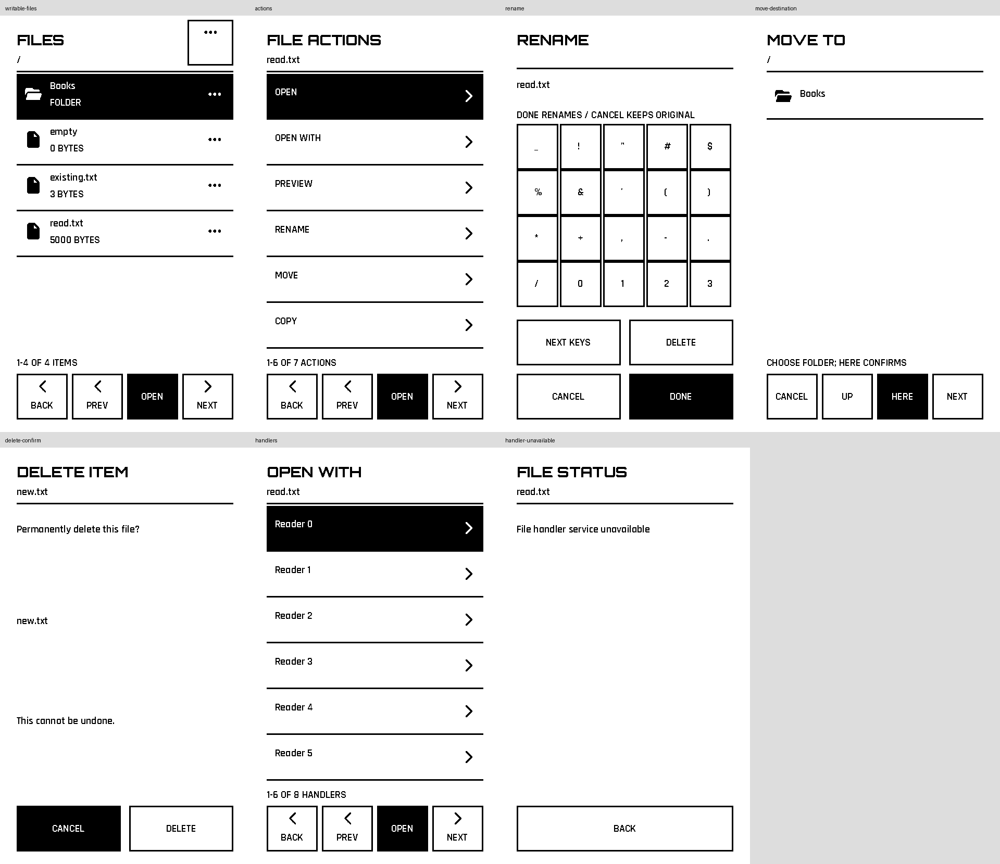

# Paper File Browser evidence

Source foundation: System Apps PR #57 at
`4b564e5cb67c1c918fc1a24298e923f816de484e`. The initial six-row browser/filter/
preview checkpoint was tested and committed before file management was added.
The mockup's actual 480×800 images were inspected before presentation work.

## Exact upstream inputs

Reader repository: `michaelrolphone-cmyk/T5S3-Reader`, commit
`34d8e694d89a1e72d8854403d8592c289fae3ddc` (read-only).

| Input | SHA-256 |
| --- | --- |
| `Apps/file_browser.c` | `5e281d994b6d7770db067ee146e6428a22eac4a7835e67e9a4b997d434c32e39` |
| `sdk/driver/RiscStorageVolumeV1.h` | `969d1283b622fe3109cd52ab48749012f9dd0cb7396f80d7a7a085ec7b8aa517` |
| `lib/NativeApps/include/T5FileOpenApi.h` | `c1b873e364dba81ce39d8c8a62668db618735407a6291dca87b9795ce4accc30` |

`lib/PortableApps/SOURCES.json` records the portable storage header's exact
provenance. The canonical `T5FileOpenApi.h` already matches the frozen Reader
bytes. The existing legacy SDK snapshot is not replaced or rebaselined.

## Executed checks

- Native plus ASan/UBSan Watch controller/raster tests, both touch rotations,
  with and without alarm/navigation/quick-controls.
- Actual native-800×480 MONO1 adapter + logical-480×800 paper controller: six-row
  ordering, 513-entry forward/backward paging, all 95 printable keyboard keys,
  no-op repeated draws, preview boundaries, empty/malformed/absent storage,
  retained-close retry and real raw-touch lifecycle.
- Native plus ASan/UBSan writable SD/secondary-volume tests: rename invalid-name/
  collision/success, same-volume move, self-descendant protection, same-volume
  and cross-volume copies, short I/O, empty copy, destination collision, source
  growth, read/write failures, destination commit-close retry preserving commit,
  source close failure aborting output, checked directory-close retention,
  listing error, each grant-release failure/retry, cancel vs confirmed delete,
  recursive hidden/nested deletion and no leaked handles/grants.
- Handler unavailable/no declaration/malformed data, bounded paging, failed
  dispatch, terminal successful dispatch with exact copied arguments, and SD
  native ELF admission guard. Real raw-touch delete-menu/cancel/return flow.
- Repository Python unit suite; all 18 legacy Reader target builds and required
  release-byte parity (including File Browser 1.3.2).
- Pinned GCC 8.4 Xtensa builds for X4 SD paper, configured secondary/file.open
  consumer contract, and existing Watch quick-control profile. Actual structural
  ELF validation and exact import/export checks pass.

These are host/provider-contract and target-build results. They do not claim
physical e-paper, touch, SD-media or USB hardware testing. File-handler deployment
composition and hardware qualification remain separate integration work.

## Screens rendered by the real controller and raster

The contact sheet is a labelled arrangement of logical portrait frames generated
from the fixture's native framebuffer. No UI element is painted into the images.

